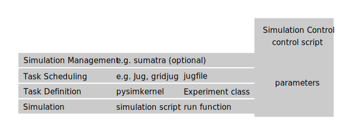

# pysimkernel Specification

pysimkernel is a task definition framework that abstracts away the gory details
of implementing boilerplate code for parameter scans, repetitive simulation
runs and result aggregation.

## What does it do?

- simulation experiments with parameter scans / iterations with possibly
  several independent runs (pleasingly parallel
  settings)
- Monte Carlo simulations with Common Random Numbers

## Limitations 

- Limited to one parameter set per task
- Limited to at most one task per run

## Who is it for?

## Related Work

## Design Philosophy

## Integrations

## Model

pysimkernel defines tasks for a user-defined simulation experiment.
pysimkernel is not a task scheduler.

One should be able to use pysimkernel both interactively in the Notebook (by
the means of a decorator and a serial or concurrent task scheduler), and on a
cluster with Jug or similar parallelization frameworks (by the means of a
central simulation control script).

### Data type

The *run* function outputs a [NumPy structured
array](http://docs.scipy.org/doc/numpy/user/basics.rec.html).
Other choices such as *pytables*, *xarray*, *pandas.DataFrame*, *h5py* are
possible.
This is a design decision as NumPy is considered stable, has multi-dimensional
arrays (as xarray, but unlike pandas.DataFrame), is resistant in memory as well
as on disk (with memmap; h5py and pytables are disk-only), and does not require
additional libraries.

### Experiment output

The output of the whole experiment is a NumPy structured array.
Its shape is linear in the parameter dimension.
If there are other dimensions present in the *single-run output*, they are
present in the experiment output as well.
The *aggregation graph* specifies the field names and data types.
The experiment also outputs a mapping (Python dictionary) that maps simulation
inputs to indices of the first dimension of the output array.

### The run function

The simulationist defines the *run function*.
For *multi-run experiments*, it takes a ``seed`` keyword argument.

It outputs (**single-run output**) a NumPy structured array.

### The task function

The task function first executes the specified number of runs.

If a *multi-run experiment* has multiple runs per task, the **task function**
subsequently merges the single-run outputs into a single NumPy array.
The merged array has the same data type as the original arrays, albeit
different shape.
The single-run outputs are arranged along the first dimension (first index
corresponds to the single run).
Note that this is just the reduce function.

In all other cases, this is the identity function for the single-run output.

### The reduce function

The reduce function merges single-run outputs (or arrays of merged single-run
outputs) into a single array.

### The job function

If a *multi-run experiment* has multiple tasks per job, the job function first
reduces the task outputs into a single array (*reduce function*).

In a *multi-run experiment*, the job function subsequently aggregates the
single-run outputs to statistics according to the *aggregation graph*.

In *mono-run experiments*, the job function is the identity function (as there
is no statistics to aggregate).

### The experiment function

The experiment function merges statistics for all jobs (simulation inputs) into
a single numpy array.
This is again just the reduce function.

### The task graph

A sample task graph for a multi-run experiment with multiple (2) tasks per job
and multiple (2) runs per task, and two sets of input parameters, leading to
8 runs in total (with Common Random Numbers).

### The reduced task graph

A reduced version of the task graph.
These are the task that are actually up for external scheduling, as the
``task`` function executes the single runs.

## Terminology

- **simulation input**: a (single) combination of parameter values
- **multi-run** and **mono-run** experiments:
  A typical instance of a **multi-run** experiment is a stochastic experiment,
  which runs the simulation several times for each combination of parameter
  values, but with different random seeds.
  A **mono-run** experiment runs the simulation only once for each input.
  A typical instance of a mono-run experiment is a simulation of a
  deterministic system.
- With **Common Random Numbers**, the same seeds are used across all inputs in
  a multi-run experiment.
- **simulation control script**, canonical name ''simcontrol.py''

## API

### The Aggregation Graph / Decorator

The aggregation graph aggregates single-run simulation outputs of the *run*
function for each combination of parameter values in *multi-run experiments*.

This has no effect for *mono-run experiments*.

The aggregation graph is a list of dictionaries with the keys

- ``'run_output'``: a list of fields from the *single-run output* or ':' (for all fields)
- ``'input_params'`` (optional, defaults to ``False``): a list of parameters or
  Boolean (``True`` for all parameters)
- ``'function'``: the aggregation function, takes one argument if
  ``input_params`` is ``False`` and two otherwise. The first argument is the
  (selected) outputs of the single runs, the second argument are the requested
  input parameters.
- ``'output_dtype'`` (optional, defaults to ``np.float``): the data type of the
  output field.
- ``'output_name'`` (optional): the name of the output field. Defaults to the first
  of the input fields and the function name, separated by an underscore.

### The Experiment Class / Decorator

Takes as construction arguments:

- ``simparams`` (*simulation parameters*): an iterable of *simulation inputs*
  in the form of argument lists or keyword argument dictionaries to be supplied
  to the *run* function at each iteration run, excluding the *seed*.
  (**simulation input**)
- ``aggregation``: *aggregation graph* (**simulation output**)
- ``taskdef``: *task definition parameters*, number of runs per task, number of
  tasks per job, how to store result

All arguments are Python dictionaries.

The ``task_graph`` method provides a [dask task
graph](http://dask.pydata.org/en/latest/graphs.html).

### Utilities for Jug integration

The ``dask2jug`` function converts a [dask task
graph](http://dask.pydata.org/en/latest/graphs.html) to a list of [Jug
tasks](https://jug.readthedocs.org/en/latest/tasks.html).

The ``jugfile`` function returns a
[jugfile](https://jug.readthedocs.org/en/latest/tutorial.html?highlight=jugfile#task-generators)
to be written to disk and run with
[Jug](https://jug.readthedocs.org/en/latest/) or
[gridjug](http://gridjug.readthedocs.org/en/stable/).

For using a single control file with gridjug, we can pickle the simparams,
aggregation and taskdef dictionaries and store their pickled strings in an
automatically generated jugfile (use a template engine!).
The control file could be also enhanced to [connect to
sumatra](http://pythonhosted.org/Sumatra/using_the_api.html).
